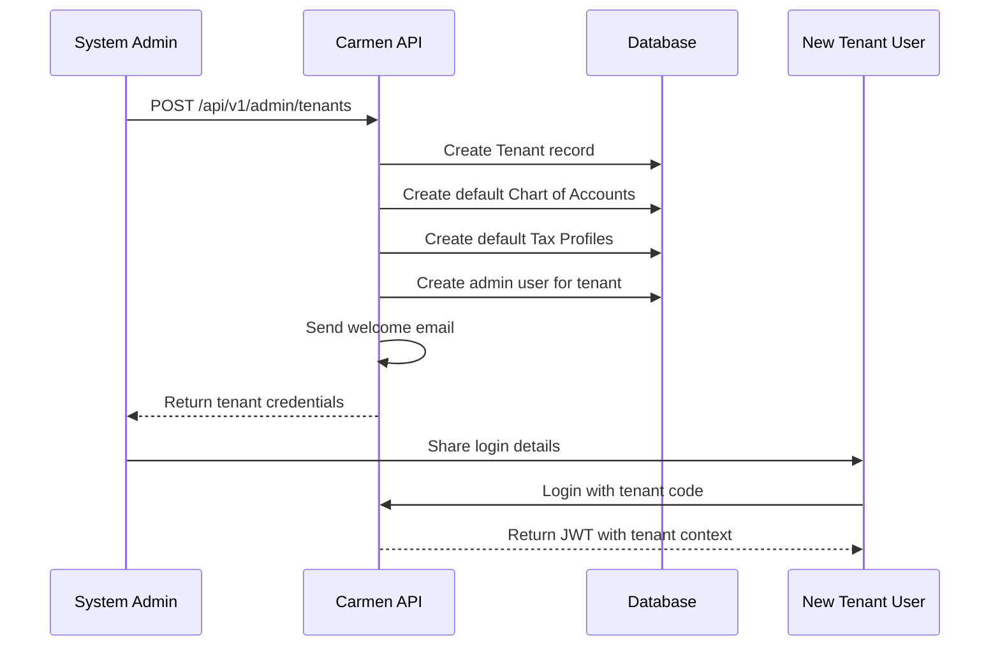

# Multi-Tenancy Architecture
## Carmen SAAS Financial Accounting System

**Version:** 1.0
**Date:** January 2026

---

## Table of Contents

1. [Overview](#1-overview)
2. [User Role Hierarchy](#2-user-role-hierarchy)
3. [Multi-Tenancy Strategy](#3-multi-tenancy-strategy)
4. [Tenant Isolation](#4-tenant-isolation)
5. [Authentication & Authorization](#5-authentication--authorization)
6. [Database Design](#6-database-design)
7. [API Design](#7-api-design)
8. [Dashboard Multi-Tenant Views](#8-dashboard-multi-tenant-views)
9. [Tenant Configuration](#9-tenant-configuration)
10. [Notification & Email in Multi-Tenant Context](#10-notification--email-in-multi-tenant-context)
10.5. [Semantic Search in Multi-Tenant Context](#105-semantic-search-in-multi-tenant-context)
11. [Security Considerations](#11-security-considerations)
12. [Migration & Scaling](#12-migration--scaling)

---

## 1. Overview

Carmen uses a **Shared Database, Shared Schema** multi-tenancy approach with row-level isolation. This allows multiple hotel properties (tenants) to share the same infrastructure while maintaining complete data separation.

### Key Benefits

| Benefit | Description |
|---------|-------------|
| **Cost Efficiency** | Shared resources reduce infrastructure costs |
| **Easy Maintenance** | Single codebase and database to manage |
| **Rapid Provisioning** | New tenants can be onboarded quickly |
| **Data Isolation** | Complete logical separation of tenant data |
| **Scalability** | Support for 1000+ tenants on single instance |

---

## 2. User Role Hierarchy

Carmen supports a hierarchical user role system that determines data access and dashboard capabilities.

### 2.1 Role Hierarchy

```
┌─────────────────────────────────────────────────────────────┐
│                      USER ROLE HIERARCHY                    │
├─────────────────────────────────────────────────────────────┤
│                                                             │
│  ┌──────────────────┐      Can access:                     │
│  │   System Admin   │      - All tenants                   │
│  │  (TenantId=NULL) │      - System-level configuration    │
│  └────────┬─────────┘      - Tenant management              │
│           │                                                 │
│  ┌────────▼─────────┐      Can access:                     │
│  │   Group Admin    │      - Assigned tenants only         │
│  │ (TenantId=Group) │      - Multi-tenant dashboard        │
│  └────────┬─────────┘      - Cross-tenant reports          │
│           │                                                 │
│  ┌────────▼─────────┐      Can access:                     │
│  │   Tenant Admin   │      - Their tenant only             │
│  │  (TenantId=X)    │      - Tenant configuration          │
│  └────────┬─────────┘      - User management               │
│           │                                                 │
│  ┌────────▼─────────┐      Can access:                     │
│  │   Regular User   │      - Their tenant only             │
│  │  (TenantId=X)    │      - Assigned permissions          │
│  └──────────────────┘                                      │
│                                                             │
└─────────────────────────────────────────────────────────────┘
```

### 2.2 Role Definitions

| Role | TenantId | Access Scope | Dashboard Views |
|------|----------|--------------|-----------------|
| **System Admin** | NULL | All tenants | Single, Aggregated, Compare |
| **Group Admin** | Group ID | Assigned tenants only | Single, Aggregated, Compare |
| **Tenant Admin** | Tenant ID | Their tenant only | Single tenant |
| **Regular User** | Tenant ID | Their tenant only | Single tenant |

### 2.3 Permissions Matrix

| Permission | System Admin | Group Admin | Tenant Admin | Regular User |
|------------|--------------|-------------|--------------|--------------|
| `Dashboard.ViewAll` | ✅ | ✅ | ❌ | ❌ |
| `Dashboard.Compare` | ✅ | ✅ | ❌ | ❌ |
| `Dashboard.SwitchTenant` | ✅ | ✅ | ❌ | ❌ |
| `System.Tenant.Manage` | ✅ | ❌ | ❌ | ❌ |
| `GL.JournalVoucher.Create` | ✅ | ✅ | ✅ | ✅* |
| `AP.Invoice.Approve` | ✅ | ✅ | ✅ | ✅* |

*Requires module-specific permission assignment

### 2.4 Group Admin Tenant Assignment

```sql
-- Group admin can access specific tenants
CREATE TABLE GroupTenantAccess (
    GroupTenantAccessId CHAR(36) PRIMARY KEY,
    UserId CHAR(36) NOT NULL,           -- Group Admin user
    TenantId CHAR(36) NOT NULL,          -- Tenant they can access
    AssignedAt TIMESTAMP DEFAULT CURRENT_TIMESTAMP,
    AssignedBy CHAR(36),                -- System admin who assigned
    FOREIGN KEY (UserId) REFERENCES User(UserId),
    FOREIGN KEY (TenantId) REFERENCES Tenant(TenantId),
    UNIQUE KEY uk_user_tenant (UserId, TenantId)
);
```

---

## 3. Multi-Tenancy Strategy

### 3.1 Architecture Pattern

```
┌─────────────────────────────────────────────────────────────────────────┐
│                         MULTI-TENANT ARCHITECTURE                       │
├─────────────────────────────────────────────────────────────────────────┤
│                                                                         │
│    ┌──────────────┐    ┌──────────────┐    ┌──────────────┐          │
│    │   Tenant A   │    │   Tenant B   │    │   Tenant C   │          │
│    │  (Hotel 1)   │    │  (Hotel 2)   │    │  (Hotel 3)   │          │
│    └──────┬───────┘    └──────┬───────┘    └──────┬───────┘          │
│           │                   │                   │                   │
│           └───────────────────┼───────────────────┘                   │
│                               │                                       │
│                    ┌──────────▼──────────┐                            │
│                    │   Application Layer │                            │
│                    │  (Tenant Filtering) │                            │
│                    └──────────┬──────────┘                            │
│                               │                                       │
│                    ┌──────────▼──────────┐                            │
│                    │   Shared Database   │                            │
│                    │  (Row-Level Filter) │                            │
│                    └─────────────────────┘                            │
│                                                                         │
└─────────────────────────────────────────────────────────────────────────┘
```

### 3.2 Tenant Context Flow

```
┌─────────┐     ┌─────────┐     ┌─────────┐     ┌─────────┐     ┌─────────┐
│  User   │────>│  Login  │────>│   JWT   │────>│  API    │────>│ Database│
│ Request │     │ Request │     │  Token  │     │ Request │     │  Query  │
└─────────┘     └─────────┘     └────┬────┘     └────┬────┘     └────┬────┘
                                      │               │               │
                              ┌───────▼───────┐       │               │
                              │ JWT contains: │       │               │
                              │ - TenantId    │───────┘               │
                              │ - TenantCode  │                       │
                              │ - Permissions │                       │
                              └───────────────┘                       │
                                                                     │
                              ┌──────────────────────────────────────▼───────┐
                              │  SELECT * FROM JournalVoucher                  │
                              │  WHERE TenantId = @CurrentTenantId            │
                              │  -- Automatically applied via filter           │
                              └───────────────────────────────────────────────┘
```

---

## 4. Tenant Isolation

### 3.1 Global Query Filters

Every tenant-scoped entity automatically applies a filter to ensure data isolation:

```csharp
// DbContext configuration
public class CarmenDbContext : DbContext
{
    private readonly ITenantContext _tenantContext;

    public CarmenDbContext(DbContextOptions<CarmenDbContext> options,
                          ITenantContext tenantContext)
        : base(options)
    {
        _tenantContext = tenantContext;
    }

    protected override void OnModelCreating(ModelBuilder modelBuilder)
    {
        // Apply tenant filter to all tenant entities
        modelBuilder.Entity<JournalVoucher>()
            .HasQueryFilter(jv => jv.TenantId == _tenantContext.TenantId);

        modelBuilder.Entity<Invoice>()
            .HasQueryFilter(inv => inv.TenantId == _tenantContext.TenantId);

        modelBuilder.Entity<Vendor>()
            .HasQueryFilter(v => v.TenantId == _tenantContext.TenantId);

        modelBuilder.Entity<Customer>()
            .HasQueryFilter(c => c.TenantId == _tenantContext.TenantId);

        modelBuilder.Entity<Asset>()
            .HasQueryFilter(a => a.TenantId == _tenantContext.TenantId);

        // ... more entities
    }
}
```

### 3.2 Tenant Entities vs System Entities

| Entity Type | Tenant Filter | Example |
|-------------|---------------|---------|
| **Tenant Entities** | ✅ Applied | JournalVoucher, Invoice, Vendor, Customer, Asset |
| **System Entities** | ❌ Not Applied | Tenant, User, Permission, TaxProfile (master data) |

```csharp
// System entities - shared across tenants (read-only reference data)
public class TaxProfile
{
    public Guid TaxProfileId { get; set; }
    public string Code { get; set; }
    public string Name { get; set; }
    public decimal Rate { get; set; }
    // NO TenantId - this is system-wide reference data
}
```

---

## 5. Authentication & Authorization

### 4.1 JWT Token Structure

Every JWT token contains tenant identification:

```json
{
  "sub": "123e4567-e89b-12d3-a456-426614174000",    // User ID
  "tenantId": "456e7890-e89b-12d3-a456-426614174111", // Tenant ID
  "tenantCode": "HOTEL001",                          // Tenant Code
  "tenantName": "Grand Hotel Bangkok",                // Tenant Name
  "username": "john.doe",
  "email": "john.doe@grandhotel.com",
  "permissions": [
    "GL.JournalVoucher.Create",
    "GL.JournalVoucher.Post",
    "AP.Invoice.Approve",
    "AR.Invoice.View"
  ],
  "exp": 1706745600,
  "iss": "Carmen",
  "aud": "CarmenUsers"
}
```

### 4.2 Tenant Context Service

```csharp
// Tenant context interface
public interface ITenantContext
{
    Guid TenantId { get; }
    string TenantCode { get; }
    string TenantName { get; }
    Guid UserId { get; }
    string Username { get; }
    IEnumerable<string> Permissions { get; }
}

// Implementation from JWT claims
public class TenantContext : ITenantContext
{
    private readonly IHttpContextAccessor _httpContextAccessor;

    public Guid TenantId => Guid.Parse(_httpContextAccessor.HttpContext?
        .User.FindFirst("tenantId")?.Value ?? Guid.Empty.ToString());

    public string TenantCode => _httpContextAccessor.HttpContext?
        .User.FindFirst("tenantCode")?.Value ?? string.Empty;

    // ... other properties
}
```

### 4.3 Tenant Resolution Middleware

```csharp
// Middleware to extract tenant from JWT
public class TenantResolutionMiddleware
{
    private readonly RequestDelegate _next;

    public async Task InvokeAsync(HttpContext context)
    {
        // Extract tenant info from JWT claims
        var tenantId = context.User.FindFirst("tenantId")?.Value;
        var tenantCode = context.User.FindFirst("tenantCode")?.Value;

        if (string.IsNullOrEmpty(tenantId))
        {
            context.Response.StatusCode = 401;
            await context.Response.WriteAsync("Missing tenant context");
            return;
        }

        // Set tenant context for the request
        context.Items["TenantId"] = tenantId;
        context.Items["TenantCode"] = tenantCode;

        await _next(context);
    }
}
```

---

## 6. Database Design

### 5.1 Tenant Table

```sql
CREATE TABLE Tenant (
    TenantId CHAR(36) PRIMARY KEY,
    Code VARCHAR(20) NOT NULL UNIQUE,
    Name VARCHAR(255) NOT NULL,
    DatabaseSchema VARCHAR(100),           -- Reserved for future schema isolation
    LicenseExpiry DATE NOT NULL,
    IsActive TINYINT(1) NOT NULL DEFAULT 1,
    MaxUsers INT NOT NULL DEFAULT 10,
    Settings JSON,                         -- Tenant-specific settings
    CreatedAt TIMESTAMP DEFAULT CURRENT_TIMESTAMP,
    UpdatedAt TIMESTAMP DEFAULT CURRENT_TIMESTAMP ON UPDATE CURRENT_TIMESTAMP,
    INDEX idx_code (Code),
    INDEX idx_active (IsActive)
) ENGINE=InnoDB DEFAULT CHARSET=utf8mb4;
```

### 5.2 Tenant-Scoped Entity Example

```sql
CREATE TABLE JournalVoucher (
    JournalVoucherId CHAR(36) PRIMARY KEY,
    TenantId CHAR(36) NOT NULL,           -- Tenant discriminator
    VoucherNo VARCHAR(50) NOT NULL,
    VoucherDate DATE NOT NULL,
    Description VARCHAR(500),
    PostedDate DATE,
    PostedBy CHAR(36),
    CreatedBy CHAR(36) NOT NULL,
    CreatedAt TIMESTAMP DEFAULT CURRENT_TIMESTAMP,
    UpdatedAt TIMESTAMP DEFAULT CURRENT_TIMESTAMP ON UPDATE CURRENT_TIMESTAMP,
    RowVersion TIMESTAMP DEFAULT CURRENT_TIMESTAMP ON UPDATE CURRENT_TIMESTAMP,

    FOREIGN KEY (TenantId) REFERENCES Tenant(TenantId),
    INDEX idx_tenant_id (TenantId),
    INDEX idx_tenant_date (TenantId, VoucherDate),
    INDEX idx_tenant_no (TenantId, VoucherNo),

    -- Unique constraint per tenant for voucher number
    UNIQUE KEY uk_tenant_voucher_no (TenantId, VoucherNo)
) ENGINE=InnoDB DEFAULT CHARSET=utf8mb4;
```

### 5.3 User Table (Tenant Association)

```sql
CREATE TABLE User (
    UserId CHAR(36) PRIMARY KEY,
    TenantId CHAR(36),                    -- NULL for system admin
    Username VARCHAR(100) NOT NULL UNIQUE,
    Email VARCHAR(255) NOT NULL,
    PasswordHash VARCHAR(255) NOT NULL,
    FirstName VARCHAR(100),
    LastName VARCHAR(100),
    IsActive TINYINT(1) NOT NULL DEFAULT 1,
    LastLoginAt TIMESTAMP NULL,
    CreatedAt TIMESTAMP DEFAULT CURRENT_TIMESTAMP,
    UpdatedAt TIMESTAMP DEFAULT CURRENT_TIMESTAMP ON UPDATE CURRENT_TIMESTAMP,

    FOREIGN KEY (TenantId) REFERENCES Tenant(TenantId),
    INDEX idx_tenant_id (TenantId),
    INDEX idx_username (Username)
) ENGINE=InnoDB DEFAULT CHARSET=utf8mb4;
```

---

## 7. API Design

### 6.1 URL Structure

All tenant-scoped APIs include the tenant identifier in the URL:

```
Base URL: /api/v1/tenants/{tenantId}

Examples:
GET    /api/v1/tenants/{tenantId}/gl/journal-vouchers
POST   /api/v1/tenants/{tenantId}/gl/journal-vouchers
GET    /api/v1/tenants/{tenantId}/ap/vendors
POST   /api/v1/tenants/{tenantId}/ap/invoices
GET    /api/v1/tenants/{tenantId}/ar/customers
```

### 6.2 Controller with Tenant Validation

```csharp
[ApiController]
[Route("api/v1/tenants/{tenantId}/[controller]")]
[Authorize]
public class JournalVouchersController : ControllerBase
{
    private readonly ITenantContext _tenantContext;

    [HttpGet]
    public async Task<ActionResult<PaginatedResponse<JournalVoucherDto>>> GetList(
        [FromRoute] Guid tenantId,
        [FromQuery] int page = 1,
        [FromQuery] int pageSize = 20)
    {
        // Validate tenant matches JWT
        if (tenantId != _tenantContext.TenantId)
        {
            return Forbid();
        }

        // Query automatically filtered by tenant via global filter
        var vouchers = await _repository.ListAsync(
            new JournalVoucherSpecification(tenantId, page, pageSize));

        return Ok(vouchers);
    }

    [HttpPost]
    public async Task<ActionResult<JournalVoucherDto>> Create(
        [FromRoute] Guid tenantId,
        [FromBody] CreateJournalVoucherRequest request)
    {
        // Validate tenant
        if (tenantId != _tenantContext.TenantId)
        {
            return Forbid();
        }

        // Tenant ID automatically set from context
        var voucher = new JournalVoucher
        {
            TenantId = _tenantContext.TenantId,
            // ... other properties
        };

        await _repository.AddAsync(voucher);
        return CreatedAtAction(nameof(Get), new { id = voucher.Id }, voucher);
    }
}
```

### 6.3 Tenant Validation Extension

```csharp
// Extension method for tenant validation
public static class TenantValidationExtensions
{
    public static bool ValidateTenant(this ControllerBase controller,
                                       Guid routeTenantId,
                                       ITenantContext tenantContext)
    {
        return routeTenantId == tenantContext.TenantId;
    }
}

// Usage in controller
if (!this.ValidateTenant(tenantId, _tenantContext))
{
    return Forbid();
}
```

---

## 8. Dashboard Multi-Tenant Views

System Admins and Group Admins have access to three types of dashboard views for analyzing data across multiple tenants.

### 8.1 View Modes

#### Mode 1: Tenant Switcher (Single Tenant View)

A dropdown selector that allows switching between individual tenants. Only one tenant's data is displayed at a time.

```
┌─────────────────────────────────────────────────────────────┐
│  Carmen System                          [Tenant: ▼ HOTEL001] │  ← Switcher
├─────────────────────────────────────────────────────────────┤
│                                                             │
│  ┌─────────────────┐  ┌─────────────────┐  ┌─────────────┐ │
│  │  Revenue: THB   │  │  Expenses: THB  │  │  Net Profit │ │
│  │   1,234,567     │  │     890,123     │  │   344,444   │ │
│  │   +12.3%        │  │    +8.1%        │  │   +18.2%    │ │
│  └─────────────────┘  └─────────────────┘  └─────────────┘ │
│                                                             │
│  (All widgets show data for selected tenant only)           │
└─────────────────────────────────────────────────────────────┘
```

#### Mode 2: Aggregated Rollup (Multi-Tenant Summary)

Shows combined totals across all accessible tenants with the ability to drill down into individual tenant details.

```
┌─────────────────────────────────────────────────────────────┐
│  Carmen System                    [View: All Tenants ▼]     │
├─────────────────────────────────────────────────────────────┤
│                                                             │
│  ┌─────────────────┐  ┌─────────────────┐  ┌─────────────┐ │
│  │  Total Revenue  │  │ Total Expenses  │  │ Total Profit│ │
│  │  THB 5,678,901  │  │  THB 3,456,789  │  │ THB 2,222112│ │
│  │   across 3      │  │    across 3     │  │   across 3  │ │
│  │   tenants       │  │    tenants      │  │   tenants   │ │
│  └─────────────────┘  └─────────────────┘  └─────────────┘ │
│                                                             │
│  [Click any widget to drill down to individual tenant]      │
└─────────────────────────────────────────────────────────────┘
```

#### Mode 3: Side-by-Side Comparison

Displays metrics in a comparison table format across multiple selected tenants.

```
┌─────────────────────────────────────────────────────────────┐
│  Carmen System                 [Compare: HOTEL001,002,003] │
├─────────────────────────────────────────────────────────────┤
│                                                             │
│  Metric            │ HOTEL001 │ HOTEL002 │ HOTEL003 │ Total │
│  ──────────────────┼──────────┼──────────┼──────────┼──────│
│  Revenue          │ 1.2M     │ 2.1M     │ 2.4M     │ 5.7M  │
│  Expenses         │ 0.8M     │ 1.4M     │ 1.3M     │ 3.5M  │
│  Net Profit       │ 0.4M     │ 0.7M     │ 1.1M     │ 2.2M  │
│  Profit Margin    │ 33.3%    │ 33.3%    │ 45.8%    │ 38.7% │
│  JV Count         │ 156      │ 203      │ 178      │ 537   │
│  Pending Approvals│ 12       │ 8        │ 15       │ 35    │
│                                                             │
└─────────────────────────────────────────────────────────────┘
```

### 8.2 Multi-Tenant API Endpoints

```bash
# Get user's accessible tenants
GET /api/v1/me/accessible-tenants

# Get aggregated dashboard data
GET /api/v1/dashboard/aggregated
  ?metrics=revenue,expenses,profit,journalCount
  &period=2024-01
  &groupBy=tenant

# Get comparison data for specific tenants
GET /api/v1/dashboard/compare
  ?tenantIds=xxx,yyy,zzz
  &metrics=revenue,expenses,profit,journalCount
  &period=2024-01
```

### 8.3 Frontend Tenant Context Store

```typescript
// stores/tenant-context.ts
interface TenantContext {
  mode: 'single' | 'aggregated' | 'compare';
  selectedTenantId?: string;
  selectedTenantIds?: string[];
  accessibleTenants: TenantInfo[];
  isMultiTenantUser: boolean;
}

interface TenantInfo {
  tenantId: string;
  tenantCode: string;
  tenantName: string;
  currency: string;
}

export const useTenantContext = create<TenantContext>((set) => ({
  mode: 'single',
  accessibleTenants: [],
  isMultiTenantUser: false,
  setMode: (mode) => set({ mode }),
  setSelectedTenant: (tenantId) => set({ selectedTenantId: tenantId }),
  setSelectedTenants: (tenantIds) => set({ selectedTenantIds: tenantIds }),
}));
```

---

## 9. Tenant Configuration

### 9.1 Tenant Settings Schema

```json
{
  "tenantId": "456e7890-e89b-12d3-a456-426614174111",
  "code": "HOTEL001",
  "name": "Grand Hotel Bangkok",
  "settings": {
    "localization": {
      "timezone": "Asia/Bangkok",
      "dateFormat": "dd/MM/yyyy",
      "numberFormat": {
        "decimalSeparator": ".",
        "thousandSeparator": ",",
        "decimalDigits": 2
      },
      "currency": {
        "code": "THB",
        "symbol": "฿",
        "position": "after"
      }
    },
    "accounting": {
      "fiscalYearStart": "01-01",
      "currentPeriod": "2024-01",
      "closedPeriods": ["2023-12", "2023-11"],
      "autoPost": false,
      "requireApproval": true
    },
    "features": {
      "multiCurrency": true,
      "budgetManagement": true,
      "assetManagement": true,
      "ocrIntegration": true
    },
    "integration": {
      "blueLedger": {
        "enabled": true,
        "apiUrl": "https://blueledger.example.com/api",
        "apiKey": "encrypted-key"
      }
    }
  }
}
```

### 9.2 Tenant Onboarding Flow



---

## 10. Notification & Email in Multi-Tenant Context

### 10.1 Tenant-Scoped Notifications

All notifications are scoped to the appropriate tenant context:

```csharp
// Notification entity with tenant isolation
public class Notification
{
    public Guid NotificationId { get; set; }
    public Guid? TenantId { get; set; }        // NULL for system-wide broadcasts
    public Guid UserId { get; set; }            // Target user
    public NotificationType Type { get; set; }
    public string Title { get; set; }
    public string Message { get; set; }
    public bool IsRead { get; set; }
    public DateTime CreatedAt { get; set; }
}
```

### 10.2 SignalR Group Strategy

```
┌─────────────────────────────────────────────────────────────────────────┐
│                      SIGNALR GROUP HIERARCHY                            │
├─────────────────────────────────────────────────────────────────────────┤
│                                                                         │
│  System Broadcast ──────────────────────────────────────────────────>  │
│       (all connected users, for maintenance/version updates)           │
│                                                                         │
│  ┌───────────────┐    ┌───────────────┐    ┌───────────────┐          │
│  │ Tenant A      │    │ Tenant B      │    │ Tenant C      │          │
│  │ Group         │    │ Group         │    │ Group         │          │
│  ├───────────────┤    ├───────────────┤    ├───────────────┤          │
│  │ User 1        │    │ User 4        │    │ User 7        │          │
│  │ User 2        │    │ User 5        │    │ User 8        │          │
│  │ User 3        │    │ User 6        │    │               │          │
│  └───────────────┘    └───────────────┘    └───────────────┘          │
│                                                                         │
│  Tenant Broadcast: Sends to all users within one tenant                │
│  User Direct: Sends to specific user (approval requests, etc.)         │
│                                                                         │
└─────────────────────────────────────────────────────────────────────────┘
```

### 10.3 Notification Delivery by Role

| Role | Receives | Scope |
|------|----------|-------|
| **System Admin** | System broadcasts + all tenant alerts | Global |
| **Group Admin** | System broadcasts + assigned tenant alerts | Multi-tenant |
| **Tenant Admin** | System broadcasts + their tenant notifications | Single tenant |
| **Regular User** | System broadcasts + personal notifications | Single tenant |

### 10.4 Email Template Tenant Context

Email templates include tenant branding and context:

```json
{
  "tenantId": "xxx",
  "tenantName": "Grand Hotel Bangkok",
  "tenantLogo": "https://...",
  "tenantPrimaryColor": "#1a73e8",
  "supportEmail": "support@grandhotel.com"
}
```

---

## 10.5 Semantic Search in Multi-Tenant Context

### 10.5.1 Tenant Isolation in Vector Database

All vector searches in Qdrant are filtered by TenantId to ensure complete data isolation:

```csharp
// Qdrant payload structure with tenant isolation
{
  "id": "point-uuid",
  "vector": [0.123, -0.456, ...],  // 1536 dimensions
  "payload": {
    "tenantId": "tenant-uuid",     // Required for filtering
    "entityId": "vendor-uuid",
    "entityType": "Vendor",
    "name": "ABC Cleaning Services",
    "searchableText": "ABC Cleaning Services - Bangkok - supplies"
  }
}

// Search with mandatory tenant filter
var results = await _qdrant.SearchAsync(
    collection: "vendors",
    vector: queryVector,
    filter: new Filter {
        Must = new[] {
            new Condition { Key = "tenantId", Match = tenantId.ToString() }
        }
    },
    limit: 20);
```

### 10.5.2 Collection Strategy

```
┌─────────────────────────────────────────────────────────────────────────┐
│                QDRANT COLLECTION STRATEGY                                │
├─────────────────────────────────────────────────────────────────────────┤
│                                                                         │
│  Option A: Shared Collections (Recommended for <1000 tenants)          │
│  ┌─────────────────────────────────────────────────────────────┐       │
│  │  Collection: "vendors"                                       │       │
│  │  ├── TenantA Vendors (filtered by payload.tenantId)         │       │
│  │  ├── TenantB Vendors                                        │       │
│  │  └── TenantC Vendors                                        │       │
│  └─────────────────────────────────────────────────────────────┘       │
│                                                                         │
│  Option B: Tenant Collections (For large/enterprise tenants)           │
│  ┌─────────────────────────────────────────────────────────────┐       │
│  │  Collections:                                                │       │
│  │  ├── vendors_tenant_a                                       │       │
│  │  ├── vendors_tenant_b                                       │       │
│  │  └── vendors_tenant_c                                       │       │
│  └─────────────────────────────────────────────────────────────┘       │
│                                                                         │
└─────────────────────────────────────────────────────────────────────────┘
```

### 10.5.3 Cross-Tenant Search (Admin Only)

System Admins and Group Admins can search across multiple tenants:

```csharp
public async Task<List<SearchResult>> CrossTenantSearchAsync(
    string query,
    List<Guid> tenantIds,  // Allowed tenants based on role
    CancellationToken ct)
{
    var queryVector = await _embedding.GenerateAsync(query, ct);

    var results = await _qdrant.SearchAsync(
        collection: "vendors",
        vector: queryVector,
        filter: new Filter {
            Should = tenantIds.Select(id =>
                new Condition { Key = "tenantId", Match = id.ToString() }
            ).ToArray()
        },
        limit: 50);

    return results.ToSearchResults();
}
```

### 10.5.4 Reindexing by Tenant

```csharp
// Bulk reindex for a specific tenant (e.g., after data migration)
public async Task ReindexTenantAsync(Guid tenantId, CancellationToken ct)
{
    // Delete existing tenant vectors
    await _qdrant.DeleteAsync("vendors",
        filter: new Filter {
            Must = new[] { new Condition { Key = "tenantId", Match = tenantId } }
        }, ct);

    // Reindex all tenant entities
    var vendors = await _dbContext.Vendors
        .Where(v => v.TenantId == tenantId)
        .ToListAsync(ct);

    foreach (var vendor in vendors)
    {
        await IndexEntityAsync(vendor, ct);
    }
}
```

---

## 11. Security Considerations

### 11.1 Data Isolation Guarantees

| Security Layer | Mechanism |
|----------------|-----------|
| **Application Layer** | Tenant context from JWT, global query filters |
| **API Layer** | Tenant validation in controllers |
| **Database Layer** | TenantId foreign key constraints, unique constraints |
| **Audit Layer** | All changes logged with tenant and user context |

### 11.2 Tenant Enumeration Prevention

```csharp
// Prevent tenant enumeration attacks
public class TenantEnumerationFilter : IEndpointFilter
{
    public async ValueTask<object> InvokeAsync(EndpointFilterInvocationContext context,
                                               EndpointFilterDelegate next)
    {
        var tenantId = context.HttpContext.User.FindFirst("tenantId")?.Value;

        // If accessing different tenant, return 404 instead of 403
        var routeTenantId = context.GetArgument<Guid>("tenantId");
        if (routeTenantId.ToString() != tenantId)
        {
            return Results.NotFound();
        }

        return await next(context);
    }
}
```

### 11.3 Cross-Tenant Access Prevention

```csharp
// Audit filter to detect cross-tenant access attempts
public class CrossTenantAuditFilter
{
    private readonly ILogger<CrossTenantAuditFilter> _logger;

    public void OnActionExecuting(ActionExecutingContext context)
    {
        var tenantId = _tenantContext.TenantId;
        var routeTenantId = context.ActionArguments["tenantId"]?.ToString();

        if (routeTenantId != tenantId.ToString())
        {
            _logger.LogWarning(
                "Cross-tenant access attempt: User {UserId} from Tenant {TenantId} " +
                "attempted to access tenant {RouteTenantId}",
                _tenantContext.UserId, tenantId, routeTenantId);
        }
    }
}
```

---

## 12. Migration & Scaling

### 12.1 Tenant Data Export/Import

```csharp
// Tenant data export service
public interface ITenantExportService
{
    Task<TenantExportData> ExportTenantDataAsync(Guid tenantId);
    Task ImportTenantDataAsync(Guid tenantId, TenantExportData data);
}

public record TenantExportData
{
    public Guid TenantId { get; init; }
    public string TenantCode { get; init; }
    public IEnumerable<Account> ChartOfAccounts { get; init; }
    public IEnumerable<JournalVoucher> JournalVouchers { get; init; }
    public IEnumerable<Vendor> Vendors { get; init; }
    public IEnumerable<Customer> Customers { get; init; }
    // ... other entities
}
```

### 12.2 Scaling Strategies

| Strategy | Description | When to Use |
|----------|-------------|-------------|
| **Vertical Scaling** | Increase server resources | < 100 tenants |
| **Database Sharding** | Split tenants across databases | 100-1000 tenants |
| **Read Replicas** | Separate read servers | Report-heavy workloads |
| **Microservices** | Module-based services | 1000+ tenants |

### 12.3 Database Sharding Example

```csharp
// Shard resolution based on tenant
public interface IShardResolver
{
    string GetShardConnectionString(Guid tenantId);
}

public class ShardResolver : IShardResolver
{
    private readonly IConfiguration _configuration;
    private readonly IMemoryCache _cache;

    public string GetShardConnectionString(Guid tenantId)
    {
        // Determine shard based on tenant hash or lookup table
        var shardId = _cache.GetOrCreateAsync($"shard_{tenantId}", entry =>
        {
            var shardMapping = _db.TenantShardMappings
                .FirstOrDefaultAsync(t => t.TenantId == tenantId);
            return Task.FromResult(shardMapping.Result?.ShardId);
        });

        return _configuration.GetConnectionString($"Shard{shardId}");
    }
}
```

---

## Summary

The Carmen multi-tenancy architecture provides:

- ✅ **Complete Data Isolation** - Row-level filtering on all tenant entities
- ✅ **Tenant Context** - Automatic tenant identification from JWT
- ✅ **Scalability** - Support for 1000+ tenants
- ✅ **Security** - Multiple layers of tenant validation
- ✅ **Flexibility** - Tenant-specific configuration and feature flags
- ✅ **Audit Trail** - All actions logged with tenant context

For implementation details, see:
- [GDD.md](./GDD.md) - Overall architecture
- [AGENT.md](./AGENT.md) - Development guidelines
- [TASKS.md](./TASKS.md) - Implementation tasks
